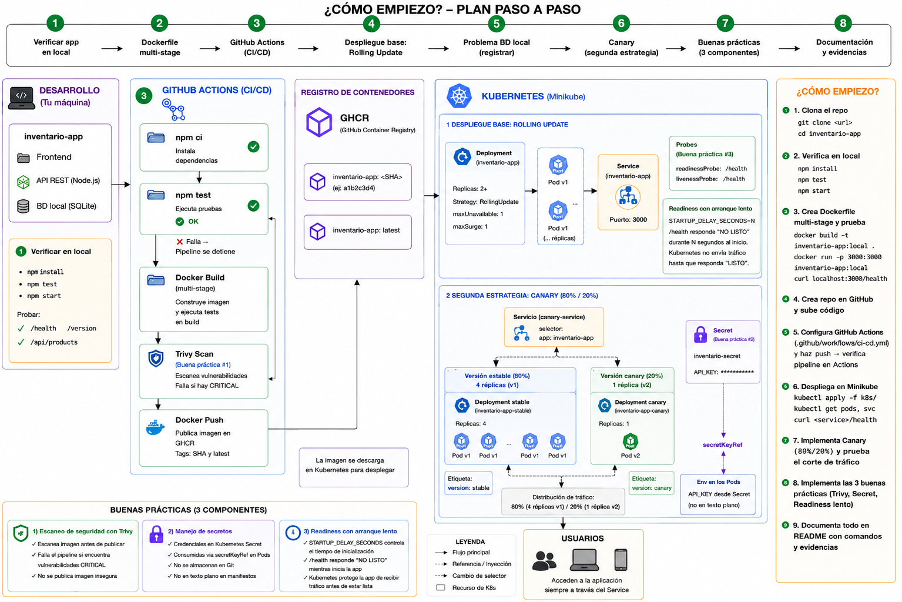

# inventario-app

Catálogo de inventario con interfaz web y base de datos local. Este repositorio es el **punto de partida** de la tarea de CI/CD — no incluye `Dockerfile`, workflow de GitHub Actions ni manifiestos de Kubernetes: esos tres se construyen como parte del trabajo asignado.

## Qué es

Una app Node.js/Express con:

- **Interfaz web** (`public/index.html`, `public/app.js`, `public/styles.css`): una tabla de productos con formulario para agregar y botón para eliminar.
- **Base de datos local** (`db.js`): un archivo JSON en `data/products.json` que persiste los productos entre reinicios del proceso — sin motor de base de datos externo ni dependencias nativas.
- **API REST** consumida por la interfaz.

## Ejecutar en local

```bash
npm install
npm start
# abrir http://localhost:3000
```

## Pruebas

```bash
npm test
```

## Endpoints

| Método y ruta | Qué hace |
|---|---|
| `GET /health` | Estado de salud: `200` si el proceso y el archivo de base de datos son accesibles, `500` si no (o si `SIMULATE_FAILURE=true`). |
| `GET /version` | Devuelve `version`, `color` y `hostname` — configurables por variables de entorno `APP_VERSION` / `APP_COLOR`. |
| `GET /api/products` | Lista todos los productos. |
| `GET /api/products/:id` | Devuelve un producto por id. |
| `POST /api/products` | Crea un producto (`name`, `sku`, `stock`, `price`). |
| `PATCH /api/products/:id` | Actualiza campos de un producto. |
| `DELETE /api/products/:id` | Elimina un producto. |
| `GET /` | Sirve la interfaz web. |

## Variables de entorno

| Variable | Por defecto | Para qué |
|---|---|---|
| `PORT` | `3000` | Puerto del servidor. |
| `APP_VERSION` | `v1` | Se muestra en `/version` y en el encabezado de la interfaz. |
| `APP_COLOR` | `blue` | Color del encabezado — útil para distinguir versiones en un despliegue. |
| `SIMULATE_FAILURE` | `false` | Si es `true`, `/health` responde siempre `500`. |
| `DB_PATH` | `./data/products.json` | Ruta del archivo de base de datos local. |

## Guía de Comandos y Despliegue de la Práctica (Parte I)

A continuación se detallan los comandos que se han implementado y verificado hasta el momento en la práctica.

### 1. Construcción y Ejecución Local con Docker

#### Diagrama General de Arquitectura


Para empaquetar la aplicación en un contenedor de Docker utilizando el `Dockerfile` multi-stage y validar su correcto funcionamiento localmente:

**Construir la imagen de Docker:**
```bash
docker build -t inventario-app:v1 .
```

**Ejecutar el contenedor localmente:**
```bash
docker run -d -p 3000:3000 --name inventario-container inventario-app:v1
```

**Verificar las rutas principales (con curl):**
```bash
# Ruta de la interfaz web
curl http://localhost:3000/

# Endpoint de salud (debe retornar 200 OK)
curl http://localhost:3000/health

# Endpoint de versión de la app
curl http://localhost:3000/version

# Endpoint para listar productos de la API
curl http://localhost:3000/api/products
```

**Detener y eliminar el contenedor local:**
```bash
docker stop inventario-container
docker rm inventario-container
```

---

### 2. Control de Versiones y Repositorio Git

Comandos utilizados para inicializar el repositorio y vincularlo con GitHub:

```bash
# Inicializar repositorio Git local
git init

# Agregar todos los archivos del proyecto (excluyendo lo declarado en .gitignore)
git add .

# Guardar cambios locales con un commit explicativo
git commit -m "feat: setup dockerfile, workflow and fix file paths"

# Renombrar rama principal a main
git branch -M main

# Vincular con el repositorio remoto de GitHub
git remote add origin https://github.com/XavierStalin/inventario-app.git

# Subir los archivos por primera vez y configurar seguimiento
git push -u origin main
```

---

### 3. Pipeline de Integración Continua (GitHub Actions)

El workflow se activa automáticamente en cada `git push` a la rama `main` y consta de los siguientes pasos:

1. **Job `build-test`**: Descarga el código, instala todas las dependencias con `npm ci` y ejecuta `npm test`. Si las pruebas fallan, el pipeline se detiene inmediatamente (fail-fast).
2. **Job `build-push`**:
   - Inicia sesión de forma segura en GitHub Container Registry (`ghcr.io`).
   - Genera los metadatos y etiquetas para la imagen (incluyendo el hash del commit y la etiqueta `latest`).
   - Construye y carga localmente la imagen utilizando `load: true`.
   - **Escaneo de Seguridad con Trivy**: Ejecuta un escaneo de vulnerabilidades críticas. Si detecta alguna vulnerabilidad de severidad `CRITICAL`, el pipeline fallará con código de salida `1` para prevenir la publicación de imágenes inseguras.
   - **Publicar**: Publica la imagen limpia en el registro GHCR si supera todos los filtros de seguridad.

---

### 4. Preparación del Entorno de Kubernetes (Minikube)

Para aislar esta práctica de otras actividades sin eliminar configuraciones anteriores:

**Crear un nuevo perfil de Minikube:**
```bash
minikube start -p practica-inventario
```

**Verificar el estado del nuevo perfil:**
```bash
minikube profile list
```

**Detener el cluster al finalizar la sesión de trabajo:**
```bash
minikube stop -p practica-inventario
```

---

### 5. Despliegue en Kubernetes y Verificación de Buenas Prácticas

> [!IMPORTANT]
> **Preparación de Secretos (Seguridad):**
> Dado que `k8s/secret.yaml` está excluido de Git para evitar filtrar credenciales, antes de desplegar por primera vez debes crear el archivo a partir de la plantilla:
> ```bash
> cp k8s/secret.example.yaml k8s/secret.yaml
> ```

**Fase 1: Despliegue Base y Buenas Prácticas (Recomendado)**
```bash
# Aplicar secretos, servicio principal y deployment rolling update base
kubectl apply -f k8s/
```

**Fase 2: Despliegue Canary (Limpiar base primero para evitar saturar Minikube)**
```bash
# Eliminar despliegue base
kubectl delete -f k8s/

# Aplicar despliegue de estrategia Canary (v1 y v2)
kubectl apply -f k8s/canary/
```

**Verificar despliegue:**
```bash
kubectl get deployments
kubectl get pods
kubectl get services
```

**Demostración 1: Reparto de Tráfico en Despliegue Canary:**
```bash
# Probar el balanceo de carga real (Kube-Proxy) realizando 20 peticiones HTTP dentro del clúster:
# Reparto aproximado: 80% v1.0-stable (azul) y 20% v2.0-canary (verde)
kubectl run test-canary --rm -i --restart=Never --image=curlimages/curl -- sh -c "for i in 1 2 3 4 5 6 7 8 9 10 11 12 13 14 15 16 17 18 19 20; do curl -s http://inventario-canary-service/version; echo ''; done"
```

**Demostración 2: Manejo de Secretos (Sin texto plano):**
```bash
# Obtener un pod activo y consultar la variable de entorno API_KEY inyectada desde Secret
kubectl exec $(kubectl get pods -l app=inventario-app -o jsonpath='{.items[0].metadata.name}') -- env | grep API_KEY
```

**Demostración 3: Readiness Probe y Arranque Lento:**

Dado que implementamos una validación de arranque lento real de 10 segundos en el servidor (`STARTUP_DELAY_SECONDS: 10`), puedes comprobar el funcionamiento de la Readiness Probe de dos formas:

1. **Observar la transición en tiempo real:**
   Ejecuta el siguiente comando inmediatamente después de aplicar los manifiestos base. Verás que los pods se reportan en `Running` pero con `0/1 READY` (no listos para tráfico). Transcurridos 12 segundos (los 10s de arranque lento + el inicio de la sonda), cambiarán automáticamente a `1/1 READY`:
   ```bash
   kubectl get pods -l app=inventario-app -w
   ```

2. **Verificar el log de eventos:**
   Al inspeccionar el pod mientras inicia, verás reflejados los códigos de estado `503` devueltos por `/health` durante el arranque antes de completarse exitosamente:
   ```bash
   kubectl describe pod -l app=inventario-app
   # Revisa los 'Events' al final: reportará advertencias "Readiness probe failed: HTTP probe failed with statuscode: 503"
   ```

**Demostración 4: Pérdida de Datos en Almacenamiento Efímero:**
```bash
# Terminal 1: Redirigir el servicio principal
kubectl port-forward svc/inventario-service 8080:80

# Terminal 2: Crear producto y eliminar el pod para evidenciar la pérdida de datos
curl -X POST http://localhost:8080/api/products -H "Content-Type: application/json" -d '{"name":"Mouse Gamers","sku":"MOU-001","stock":10,"price":25}'
curl -s http://localhost:8080/api/products

# Eliminar el pod
kubectl delete pod $(kubectl get pods -l app=inventario-app -o jsonpath='{.items[0].metadata.name}')
```

> [!NOTE]
> **Comportamiento esperado en la terminal del port-forward:**
> Al eliminar el pod activo, la Terminal 1 que ejecuta `kubectl port-forward` se cerrará con un error del tipo `lost connection to pod` (esto es normal porque el túnel estaba atado al pod eliminado). 
> 
> Para comprobar la pérdida de datos, debes **volver a iniciar** el reenvío de puertos en la Terminal 1 para asociarla con los nuevos pods recreados por el ReplicaSet:
> ```bash
> kubectl port-forward svc/inventario-service 8080:80
> ```
> Luego, consulta el catálogo desde el navegador o usando curl:
> ```bash
> curl -s http://localhost:8080/api/products
> # Deberá retornar un arreglo vacío [] demostrando la pérdida de la base de datos local efímera.
> ```

